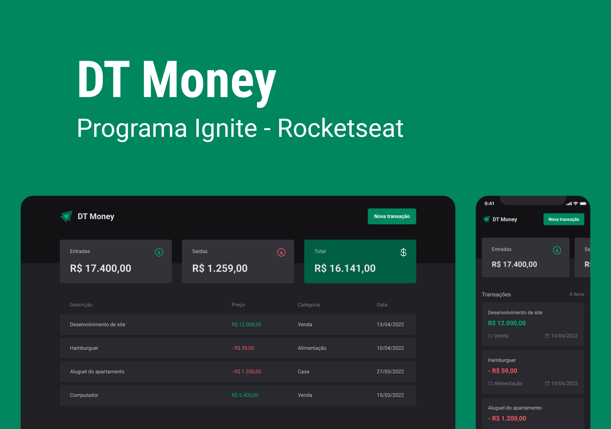

# Coffee Delivery (pt-BR)
[](#)
***DT Money Finance Control App***

**DT Money** is a finance control app, with it you can register entries and exits of financial transactions. You can also see the remaining balance calculated according to your spending

> Status: Finished... ✅

## Technologies 🚀


## Libs 📕

📑 **REACT HOOK FORM**

📑 **ZOD**

📑 **PHOSPHOR ICONS**

📑 **ESLINT**

📑 **SCHEDULER**

📑 **AXIOS**

📑 **USE CONTEXT SELECTOR**

## Features 💡

✅ **ADD INCOMING TRANSACTIONS**

✅ **ADD OUTGOING TRANSACTIONS**

✅ **CATEGORY TRANSACTIONS**

✅ **SEARCH TRANSACTIONS**

✅ **SHOW THE TOTAL OF TRANSACTIONS**

## How do use the project ⚙️

### 1. Clone the repository
```sh
git clone https://github.com/reinheimermat/dt-money
```
### 2. install dependencies
```sh
npm install
```

### 3. Run local project
```sh
npm run dev
```
### 4. Access the project
```sh
http://localhost:5173/
```

## License 📝

[](https://github.com/Ileriayo/markdown-badges/blob/master/LICENSE)

## Links 🔗

[](https://www.linkedin.com/in/reinheimermat/)
[](mailto:contatoreinheimer@gmail.com)
